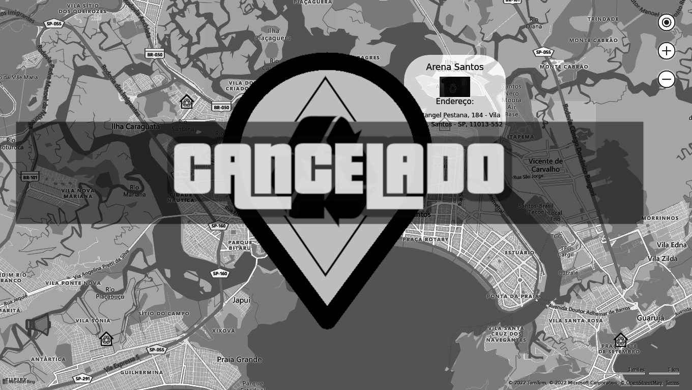

#  **RECYCLO**

    

## Projeto Cancelado

Um site voltado principalmente a localização de pontos de coleta de materiais reciclaveis, e denuncias de discarte ilegal pela cidade.

## Sobre o projeto
Front-End do sistema "Recyclo" juntamente em desenvovlvimento com o Back-End durante o 3º, 4º e 5º semestre do curso de Análise e Desenvolvimento de Sistemas FSV - Faculdade de São Vicente - Unibr.

## Integrantes
 - Paulo José `<d3xt3er>` : <https://github.com/d3xt3er> 
 - Caio Corrêia `<CaioCDJ>` : <https://github.com/CaioCDJ>
 

 
 ## Tecnologias || Linguagens 

 - <b>HTML</b>
 - <b>CSS</b>
 - <b>JavaScript</b>
 - <b>Bing Maps</b>
 - <b>SweetAlert</b>
 - <b>jQuery</b>
  
## Back-End

<https://github.com/d3xt3er/Backend-Recyclo>
